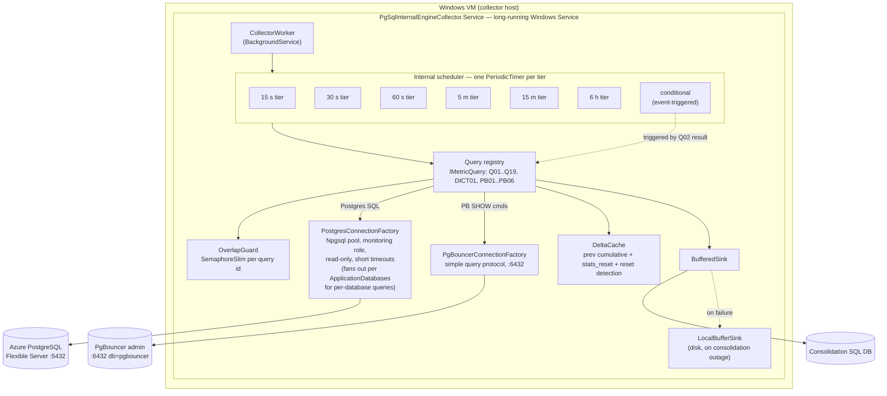

# PgSql Internal Engine Collector — Component Architecture (Windows VM)

**Status:** Workaround deployment design. The source query specification
(`astra_dms_postgresql_metrics_query_spec_v3_12.md`) still names *Azure Function* as
the primary consumer; that document is intentionally left unchanged and will be
updated separately. This document describes how the same query catalogue is run
from a **Windows VM** instead.

---

## 1. Why one long-running service, not N scheduler-launched programs

The intuitive model — one executable per cadence, each launched by Windows Task
Scheduler — does not hold for this workload, for two concrete reasons:

1. **Task Scheduler cannot repeat below 1 minute.** The Task Scheduler schema fixes
   the repetition interval to a minimum of `PT1M` (1 minute) and a maximum of 31
   days. The 15-second tier (Q02, PB02) and 30-second tier (Q04, Q07) are below
   that floor and cannot be driven by native Task Scheduler repetition. Duration
   hacks exist but Microsoft documents that the final interval can be dropped under
   heavy load — unacceptable for evidence-grade collection.
2. **Per-tick process + connection cold start is wrong at 15 s.** A fresh process
   every tick pays process spin-up, TLS handshake, auth, and pool warm-up every 15
   seconds, and makes execution overlap and timing drift *more* likely. The spec's
   own constraints ("Q02 completes in < 2 s", "does not overlap executions") point
   the other way.

So the fast/medium/conditional path lives in **one long-running Windows Service**
that owns an internal scheduler, a persistent pooled connection, in-memory delta
state, and per-query overlap guards. The OS scheduler is used only for the genuinely
out-of-band, ≥ 1-minute job: the 2-hour Storage Account → consolidation ingestion.

---

## 2. Component diagram

---

## 3. Component responsibilities

| Component | Responsibility |
|---|---|
| `CollectorWorker` | Hosted `BackgroundService`. Builds one timer loop per cadence tier and dispatches the queries registered to that tier on each tick. |
| Internal scheduler (tiers) | One `PeriodicTimer` per cadence (15 s / 30 s / 60 s / 5 m / 15 m / 6 h). Replaces Task Scheduler for sub-minute and same-process cadences. |
| Query registry | All `IMetricQuery` implementations, each declaring its `Id`, `Tier`, and `Source` (Postgres vs PgBouncer admin). Add a query = add one class + one DI registration. |
| `OverlapGuard` | One `SemaphoreSlim(1,1)` per query id. If a tick fires while the previous run of that query is still in flight, the new run is **skipped and logged** — this is the implementation of "does not overlap executions". |
| `DeltaCache` | In-memory previous cumulative value + `stats_reset` + timestamp per key. Computes `delta` / `rate_per_second` and flags a reset boundary when `stats_reset` changes or the counter goes backwards. Raw values still flow to the sink. |
| `PostgresConnectionFactory` | Npgsql pooled connections as the monitoring role. Opens one connection per database; server-wide queries target any single entry in `ApplicationDatabases`, while per-database queries (Q09, Q10, Q14, Q01D) fan out over every entry. Q11 and Q19 target `AzureSysDatabase`. Read-only, short statement/lock/idle timeouts per session. |
| `PgBouncerConnectionFactory` | Separate connection to db `pgbouncer` on port 6432, configured to use the simple query protocol so `SHOW` admin commands work (validate in smoke test, per spec §3.3). |
| `BufferedSink` | Writes results to the consolidation DB; on failure, hands off to `LocalBufferSink` so 15-second samples are never lost and collection is never blocked by a transient DB outage. |

---

## 4. Cadence tier → query mapping

Taken from the v3.12 spec scheduler table (§3.1). Conditional queries are not on a timer; they are triggered by detection inside the fast path. Per-database queries (Q09, Q10, Q14, Q01D) run once per configured `ApplicationDatabases` entry per tick.

| Tier | Interval | Queries | Driven by |
|---|---|---|---|
| Fast | 15 s | Q02, PB02 | Internal timer |
| Counter-30 | 30 s | Q04, Q07 | Internal timer |
| Counter-60 | 60 s | Q05, Q08, Q16, PB03 | Internal timer |
| Health-5m | 5 m | Q06, Q09, Q13, PB06 | Internal timer |
| Object-15m | 15 m | Q10, Q11, Q14 | Internal timer |
| Config-6h | 6 h | Q01A–D, Q15, Q17, DICT01, PB01 | Internal timer |
| Phase boundary | event | Q05 full, Q09, Q10, Q14, Q19 | Phase marker trigger |
| Conditional | event | Q03, Q12, PB04, PB05 | Triggered by fast-path detection |

---

## 5. Data flow

1. A tier timer ticks. For each query in that tier, `OverlapGuard.TryRunAsync` is
   called; if the previous run is still active, the tick is skipped and logged.
2. The query borrows a pooled connection (Postgres or PgBouncer admin), runs its
   read-only statement with `source_collected_at = clock_timestamp()`, and stamps
   `collector_received_at` on return.
3. For cumulative-counter queries, results pass through `DeltaCache` to attach
   delta / rate and detect resets. Raw cumulative values are preserved.
4. Results go to `BufferedSink`. On consolidation-DB failure they spill to local
   disk and are retried, so the fast path never blocks.
5. Conditional queries (e.g. Q03 blocking detail) are triggered when the fast-path
   Q02 result reports a matching condition (e.g. blocked PIDs present).

---

## 6. Deployment topology

- **One Windows Service** (`PgSqlInternalEngineCollector.Service`) — auto-start,
  configured with Service Recovery (restart on failure) as the watchdog. No
  external watchdog task required.
- Connects outbound to the managed Azure PostgreSQL endpoint, the PgBouncer admin
  endpoint (if PgBouncer is in scope), and the consolidation SQL DB. The collector
  touches no application traffic and runs read-only.

---

## 7. Open items to confirm before the official run

- Validate the PgBouncer admin connection actually returns `SHOW` output through the
  chosen driver mode (spec §3.3 #2 — this is a known driver pitfall).
- Confirm VM time sync (w32time / NTP) so `collector_received_at` and phase markers
  align with k6 timestamps.
- Fix the collector connection pool small (e.g. 2–3 connections) so the collector
  does not inflate the very connection-pressure metric it measures.
- Decide local buffer retention and the consolidation-DB write schema (spec §12
  minimum keys).
- Single VM + single service is a single point of failure for the 8-hour run;
  acceptable for a one-off test, but document the risk and the auto-restart +
  local-buffer mitigations.

- Configure `ApplicationDatabases` with all target application databases and validate
  that per-database queries (Q09, Q10, Q14, Q01D) fan out correctly and carry
  `database_name` in every row (spec §3.4).
- Use `OverlapGuard` keys scoped per database for per-database queries
  (e.g. `Q09:appdb1`, `Q14:appdb2`); server-wide queries keep single-key guards.
